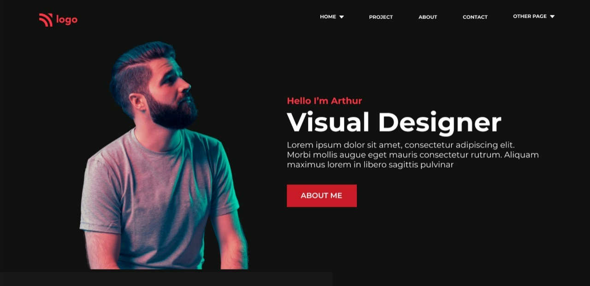
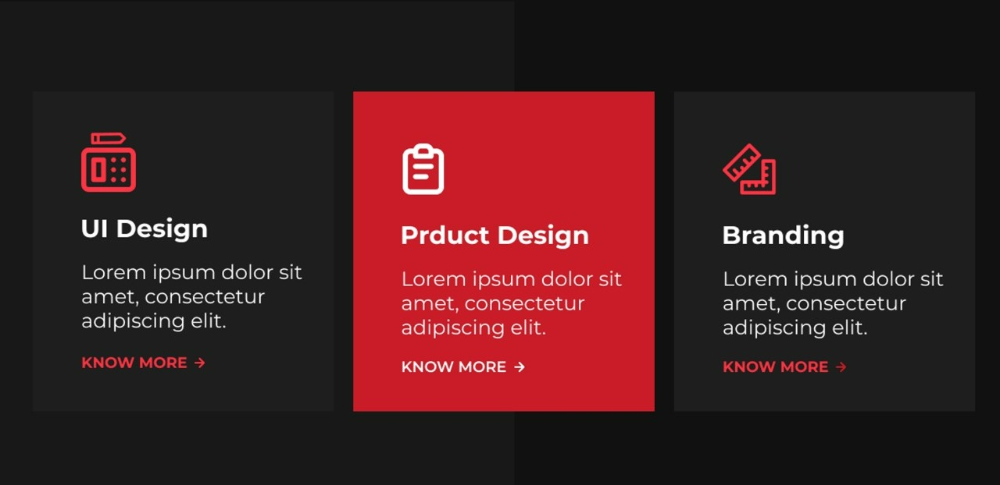
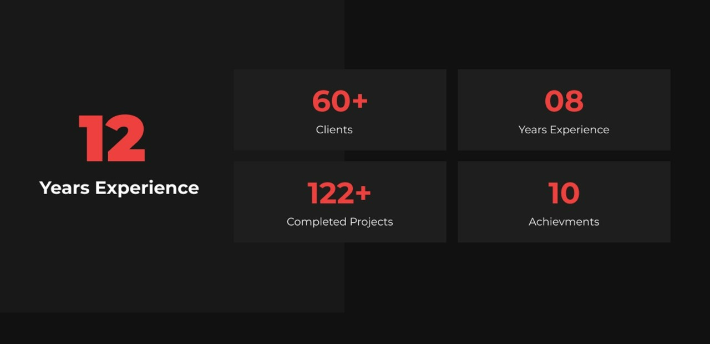
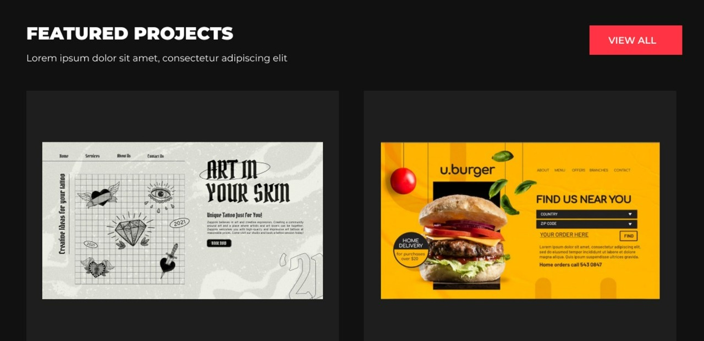
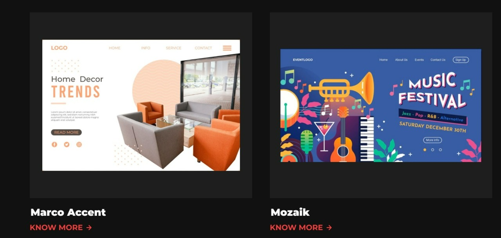
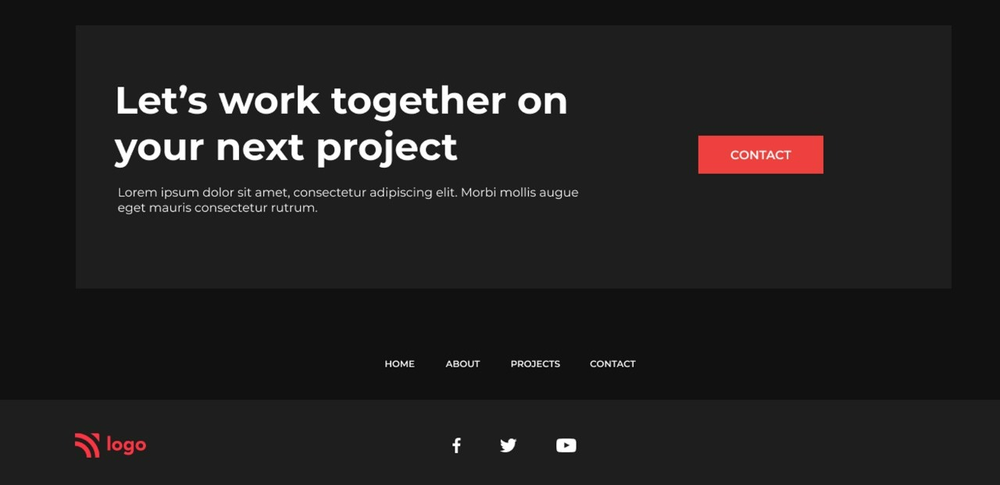

# Project 15

## This is the design which is given to convert into a web page👇

### It takes me 1 day to complete this project and important css properties such as CSS Selectors, Positions and flexbox are used.

#### *In case you are interested in this project, feel free to use these files for educational purposes*👍
👉[**Link to the Webpage**](https://ineuron-live-class-project-15-seethal.netlify.app/)

